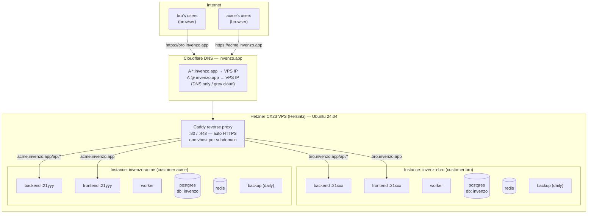
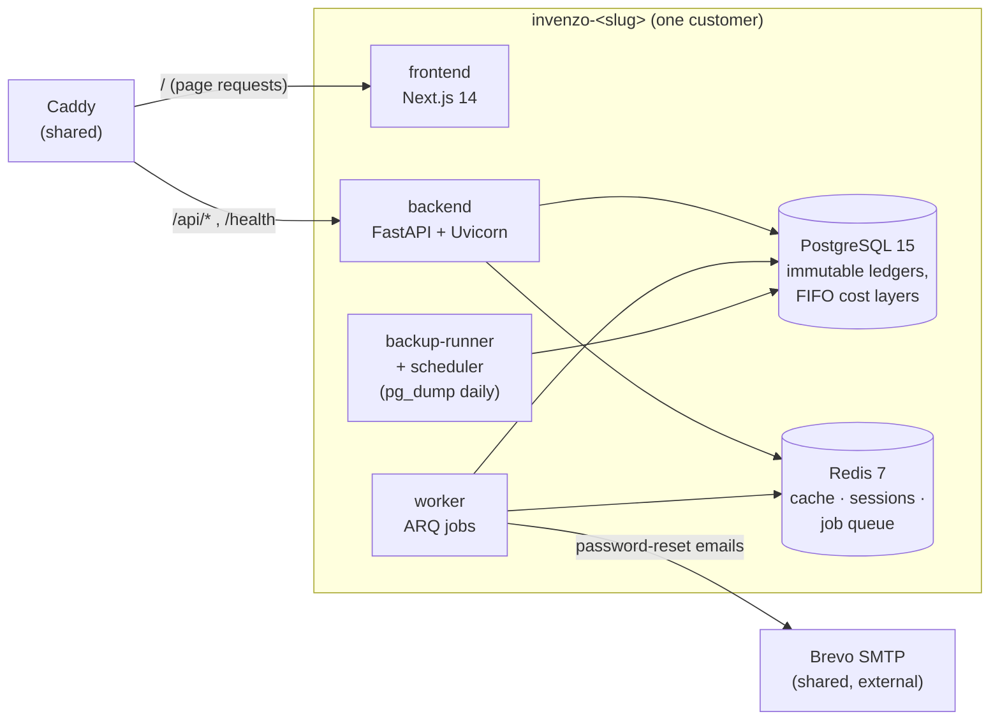
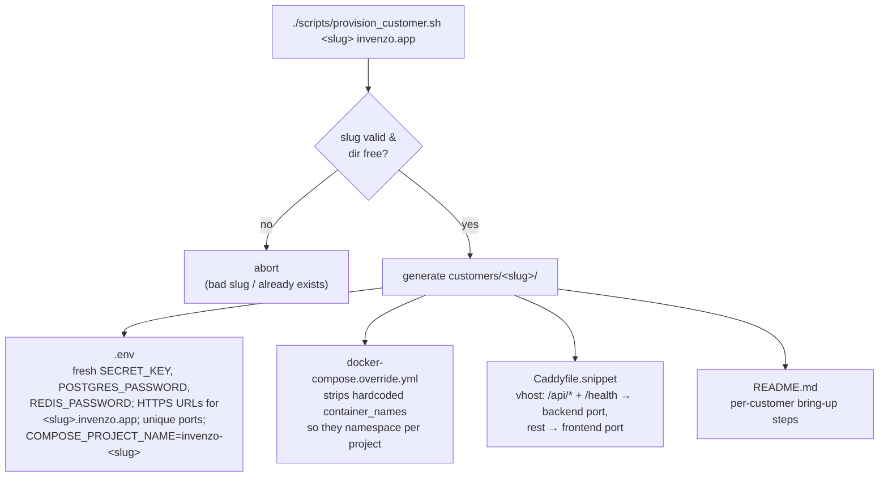

<div align="center">


# Invenzo — Architecture & Customer Onboarding

</div>

This is the single reference for **how Invenzo is deployed and how to onboard a
new customer**. It explains the architecture, the decisions behind it, and the
repeatable per-customer setup. For the literal command-by-command runbook, see
[DEPLOY_HETZNER.md](DEPLOY_HETZNER.md); for day-2 operations (backups, restore,
upgrades) see [OPERATIONS_RUNBOOK.md](OPERATIONS_RUNBOOK.md).

---

## 1. The model in one sentence

Invenzo is **single-tenant**: one running application stack serves exactly one
business, and every customer gets their own isolated stack, reached at their own
subdomain (`<customer>.invenzo.app`), all on one small VPS behind one shared
reverse proxy.

---

## 2. Why it's built this way (decisions & rationale)

| Decision | What we chose | Why | What we rejected |
|----------|---------------|-----|------------------|
| **Tenancy** | One isolated instance per customer (single-tenant per deploy) | Complete data isolation — a bug can never leak one business's data to another. Per-customer backup, restore, and deletion are trivial. Zero application code changes. | True multi-tenancy (shared DB with tenant IDs) — weeks of work, ongoing security risk, premature with a handful of customers. |
| **Hosting** | Hetzner Cloud **CX23** (2 vCPU / 4 GB / 40 GB), ~$6.49/mo | Cheapest VPS that comfortably runs the full stack. Several small instances fit on one box. | Bigger instances, managed PaaS (sleeps on free tiers, far from users, pricier). |
| **Region** | **Helsinki (eu-central)** | Hetzner has no Africa region; of the available sites, EU is closest to Nigeria (~100–150 ms to Lagos vs ~200 ms+ from US). | US East (Ashburn) — fine generally, but slower for West-African users. |
| **Domain** | One product domain `invenzo.app`, subdomain per customer | Buy DNS once; a wildcard record covers every future customer with no DNS changes. | A separate domain per customer (more cost, more DNS admin). |
| **DNS** | Cloudflare registrar, **wildcard `*` + apex `@` A records, DNS-only (grey cloud)** | Wildcard means new customers need no DNS work. DNS-only lets Caddy answer the HTTP challenge for real certs. | Cloudflare proxying (orange cloud) — interferes with Caddy's cert issuance; not needed now. |
| **HTTPS / routing** | **Caddy** reverse proxy, one vhost per subdomain, automatic Let's Encrypt certs over the HTTP challenge | Zero-config TLS, auto-renewal, and a clean per-customer routing block. No DNS API token needed. | Manual nginx + certbot (more moving parts); wildcard cert via DNS challenge (needs a registrar API token). |
| **Isolation mechanism** | `COMPOSE_PROJECT_NAME=invenzo-<slug>` + per-instance `.env` + unique loopback ports | Namespaces every container, volume, and network per customer so nothing collides; Postgres/Redis never exposed publicly. | Shared database/containers. |
| **Email** | **Brevo** free tier (300/day), STARTTLS on `smtp-relay.brevo.com:587` | Free, no card, enough for password-reset emails. Set up once, reused for every customer. | Paid SMTP; self-hosted mail (deliverability pain). |
| **Product vs internal names** | Product name = **Invenzo** everywhere; internal identifiers also renamed to `invenzo` | Consistency top to bottom. | (Originally kept internal names as `stockpilot`; later fully renamed.) |

---

## 3. Physical architecture (one VPS, many customers)



**Key points:**
- Only Caddy listens on the public ports (80/443). Every instance's containers
  publish only on `127.0.0.1:21xxx` loopback ports, so Postgres/Redis/app are
  never reachable from the internet.
- Each instance is a complete, self-contained stack. Deleting `customers/acme/`
  and running `down -v` removes that customer entirely, touching no one else.
- The port numbers (`21xxx`) are derived deterministically from the slug by the
  provision script, so two customers never collide.

---

## 4. One instance's internals (the app stack)

Every customer runs the same six-container stack, isolated under its own compose
project name.



| Container | Role | Notes |
|-----------|------|-------|
| `frontend` | Next.js UI (standalone production build) | Served pages; talks to backend at `/api/*`. |
| `backend` | FastAPI API + Uvicorn | Runs Alembic migrations on startup, then serves. DML-only DB identity. |
| `worker` | ARQ background jobs | Password-reset emails, report generation. Uses Redis as the queue. |
| `postgres` | PostgreSQL 15 | The business's data. Internal network only. Daily backups. |
| `redis` | Redis 7 | Cache, session registry, ARQ job queue. Password-protected. |
| `backup-runner` + `backup-scheduler` | `pg_dump` daily at 02:00 UTC into a per-instance `backup-data` volume | Copy dumps off-box periodically (see OPERATIONS_RUNBOOK §4). |

---

## 5. Request flow (what happens on a page load)

```
Browser → https://bro.invenzo.app
   │
   ▼
Cloudflare DNS  (resolves *.invenzo.app → VPS IP)
   │
   ▼
Caddy on the VPS  (matches the bro.invenzo.app vhost, terminates TLS)
   │
   ├── path /api/*  or /health  ─────►  bro's backend  (127.0.0.1:21xxx)
   │                                        │
   │                                        ├──► postgres  (bro's data)
   │                                        └──► redis     (bro's sessions)
   │
   └── everything else  ─────────────►  bro's frontend (127.0.0.1:21yyy)
```

---

## 6. Provisioning flow (what `provision_customer.sh` generates)



Everything the provision script writes lives in `customers/<slug>/`, which is
**gitignored** — it holds real secrets and must never be committed.

---

## 7. Onboard a new customer — quick reference

> One-time setup (VPS, Docker, Caddy, DNS wildcard, Brevo) is done once. After
> that, each new customer is these steps. Full detail in
> [DEPLOY_HETZNER.md](DEPLOY_HETZNER.md) → "Adding a new customer instance."

```bash
ssh invenzo                      # SSH config alias for the VPS
cd ~/Invenzo && git pull

# 1. Generate the instance (pick a unique DNS-safe slug)
./scripts/provision_customer.sh <slug> invenzo.app

# 2. Wire up Caddy (no DNS change needed — wildcard already covers it)
cat customers/<slug>/Caddyfile.snippet | sudo tee -a /etc/caddy/Caddyfile
sudo systemctl reload caddy

# 3. (Optional) paste Brevo SMTP creds into customers/<slug>/.env

# 4. Bring it up
docker compose --env-file customers/<slug>/.env \
  -f docker-compose.production.yml \
  -f customers/<slug>/docker-compose.override.yml \
  up -d --build

# 5. Grab the one-time admin temp password
docker compose --env-file customers/<slug>/.env \
  -f docker-compose.production.yml \
  -f customers/<slug>/docker-compose.override.yml \
  logs backend 2>&1 | grep "Temporary Password"

# 6. Verify
curl https://<slug>.invenzo.app/health
```

Then send the customer their URL (`https://<slug>.invenzo.app`), username
`admin`, and the temp password. They set a new password on first login.

### Onboarding checklist

- [ ] Slug chosen (lowercase, letters/digits/hyphens, DNS-safe, unique)
- [ ] `provision_customer.sh` run — `customers/<slug>/` created
- [ ] Caddy vhost appended and `caddy` reloaded
- [ ] (If email needed) Brevo `SMTP_USERNAME` / `SMTP_PASSWORD` set in the `.env`
- [ ] Stack up with `--build`
- [ ] `curl https://<slug>.invenzo.app/health` returns healthy
- [ ] Admin temp password captured and delivered to the customer
- [ ] (Optional) `seed_categories.py` run if they want the default catalogue
- [ ] Capacity check: `docker stats` / free memory OK on the box

---

## 8. Capacity & when to scale

A 4 GB CX23 comfortably runs **2–3 small instances**. Watch `docker stats` and
free memory. When the box gets tight:

1. **Resize up** — bump the Hetzner server a tier (CX33 = 8 GB), a few clicks +
   reboot; or
2. **Split out** — provision the customer on a second VPS and restore their DB
   dump there (OPERATIONS_RUNBOOK §4). Point their subdomain at the new box
   (per-subdomain A record overriding the wildcard).

---

## 9. What lives where (repo map)

| Path | Purpose |
|------|---------|
| `docker-compose.production.yml` | The hardened production stack definition (all instances share it). |
| `scripts/provision_customer.sh` | Generates a new customer's isolated config. |
| `customers/<slug>/` | Per-customer secrets + overrides (**gitignored**). |
| `DEPLOY_HETZNER.md` | Command-by-command first-server + per-customer runbook. |
| `OPERATIONS_RUNBOOK.md` | Day-2 ops: backup, restore, upgrades, rollback. |
| `ARCHITECTURE.md` | This file — the why and the big picture. |
| `~/.ssh/config` (your Mac) | `Host invenzo` alias so you `ssh invenzo`. |
